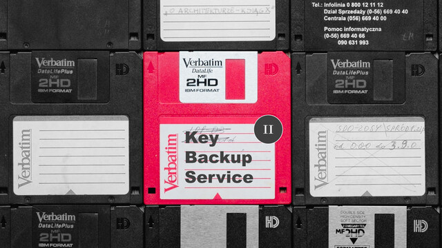

# Braceless (Key Backup Service 2)

| Key | Value |
| --- | ----- |
| ID | 58 |
| Tags (Categories) | #crypto #★★★☆☆ |
| Challenge release timestamp | 2021-11-13T06:00:00.000Z |
| Score | 350 |
| Total solves (Final) | 5 |

# YouTube

| Key | Value |
| --- | ----- |
| Avatar | 
| Singer (Challenge Author) | mystiz |
| Link | https://youtu.be/0ae7XEML3K8 |

# Description

> 根本不介意
> 擠逼都市像有點失智
> 迷迷魂魂 十二萬轉 oh oh oh
> 根本不介意
> 喜歡失意又跌多幾次
> 就算跌崩 一隻牙齒

_Note: This is part two of a two-part series. Part one: **長話短說 / Key Backup Service I**._

Mystiz is really lazy. He expects that someone would crack the bank-level encryption, but he doesn't care about that. After all, the darkest secret is not that dark.

He decided to change the numbers and release it to the public again. Now crack it!

Note: You do not need to solve _Key Backup Service I_ to solve this.

### Attachments

- [braceless_e0a09d2cb4ff894e1dcf7b2bd70a2379.zip](./braceless_e0a09d2cb4ff894e1dcf7b2bd70a2379.zip)

# Solves
| ID | Name | Solve at |
| --- | ---- | -------- |
| 912 | Beast_From_UIT | 2021-11-13T08:44:04.495Z |
| 1104 | T0003 - HKUST | 2021-11-13T11:48:58.289Z |
| 1122 | The Duck | 2021-11-13T12:32:36.469Z |
| 1162 | Super Guesser | 2021-11-13T13:28:47.516Z |
| 1195 | T0047 - HKUST | 2021-11-13T14:11:29.038Z |