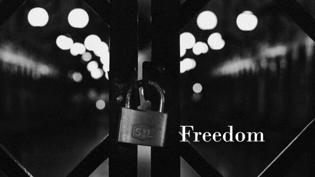

# Freedom (Cipher Mode Picker)



| Key | Value |
| --- | ----- |
| ID | 2 |
| Tags (Categories) | #crypto #★☆☆☆☆ |
| Challenge release timestamp | 2021-11-12T13:00:00.000Z |
| Score | 100 |
| Total solves (Final) | 21 |

# YouTube

| Key | Value |
| --- | ----- |
| Avatar | 
| Singer (Challenge Author) | mystiz |
| Link | https://youtu.be/HDRP9RiWXOY |

# Description

> Freedom where's our freedom?
> Freedom what would it be
> Can you tell me what's the reason?
> Reason that meant to be

Every slightest mistake in cryptography would lead to a disastrous result. Let's see what will happen when you allow end-users to pick the mode of operation...

```bash
nc chalp.hkcert21.pwnable.hk 28102
```

### Attachments

- [freedom_ff0173b179d746386dca0e93e6c00d47.zip](./freedom_ff0173b179d746386dca0e93e6c00d47.zip)

# Solves
| ID | Name | Solve at |
| --- | ---- | -------- |
| 422 | T0003 - HKUST | 2021-11-12T13:13:02.523Z |
| 448 | 天枢Dubhe | 2021-11-12T13:37:09.627Z |
| 506 | T0047 - HKUST | 2021-11-12T14:41:49.632Z |
| 563 | The Duck | 2021-11-12T15:39:51.077Z |
| 567 | T0090 - HKUST | 2021-11-12T15:42:34.581Z |
| 590 | T0042 - HKUST | 2021-11-12T16:09:38.119Z |
| 659 | O0054 - Mama Sung | 2021-11-12T18:16:53.703Z |
| 684 | DarkArmy | 2021-11-12T19:21:23.587Z |
| 768 | Super Guesser | 2021-11-13T03:35:37.995Z |
| 906 | O0067 - HC2021 | 2021-11-13T08:35:03.569Z |
| 982 | O0055 - Braindump | 2021-11-13T10:06:03.587Z |
| 1085 | O0083 - c0rrupted flags | 2021-11-13T11:24:50.932Z |
| 1141 | O0056 - AVADA KEDAVRA | 2021-11-13T12:59:04.564Z |
| 1318 | MOCSCTF-A | 2021-11-13T17:24:41.953Z |
| 1344 | T0036 - CUHK | 2021-11-13T18:24:18.729Z |
| 1363 | O0004 - AUTOEXEC.BAT | 2021-11-13T20:22:03.951Z |
| 1379 | O0010 - HackyClub | 2021-11-14T00:08:34.188Z |
| 1473 | Beast_From_UIT | 2021-11-14T05:53:13.656Z |
| 1541 | O0075 - wtfIsCTF | 2021-11-14T08:36:44.463Z |
| 1586 | O0027 - UND3r 20 D53 H473r5 4ND r374K3r | 2021-11-14T09:33:35.236Z |
| 1612 | O0061 - GoGoWeaponGo | 2021-11-14T09:48:52.047Z |