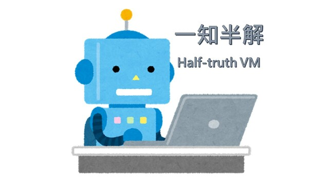

# 一知半解 (Half-truth VM)

| Key | Value |
| --- | ----- |
| ID | 45 |
| Tags (Categories) | #crypto #reverse #★★☆☆☆ |
| Challenge release timestamp | 2021-11-13T02:00:00.000Z |
| Score | 250 |
| Total solves (Final) | 2 |

# YouTube

| Key | Value |
| --- | ----- |
| Avatar | 
| Singer (Challenge Author) | harrier |
| Link | https://youtu.be/zqSd6avSuaA |

# Description

Seems the VM also have some CrYp70000 functionality.

They use this program to communicate and send flags over the air :thinking: Can we stole the flag if we have the traffic and the encrypt server?

(The VM challenges shares the same VM binary)

(P.S. `cryptoooo` and `output.txt` is that we capture from their local server)

(Update at 13/11 13:48: People in København loves to use nushell. If you are using bash, the equivalent command is `echo -n "f22ae46a891454ab2b3ef2b316357c34" | ./vm cryptoooo`.)

### Attachments

- [half-truth-vm_157d7c1d1167b4b8efc0842d0416daf4.zip](./half-truth-vm_157d7c1d1167b4b8efc0842d0416daf4.zip)

# Solves
| ID | Name | Solve at |
| --- | ---- | -------- |
| 810 | The Duck | 2021-11-13T05:26:50.830Z |
| 1564 | T0003 - HKUST | 2021-11-14T09:12:51.186Z |