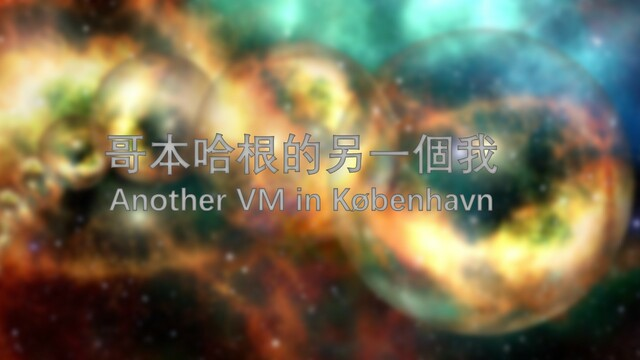

# 哥本哈根的另一個我 (Another VM in København)

| Key | Value |
| --- | ----- |
| ID | 44 |
| Tags (Categories) | #reverse #★★★☆☆ |
| Challenge release timestamp | 2021-11-13T02:00:00.000Z |
| Score | 300 |
| Total solves (Final) | 2 |

# YouTube

| Key | Value |
| --- | ----- |
| Avatar | 
| Singer (Challenge Author) | harrier |
| Link | https://youtu.be/6u7aQV_2-2U |

# Description

Folks in København seems develop an VM for fun. They want to test your skill by hiding a flag in a program that can be run with the VM.

Can you find the flag?

(The VM challenges shares the same VM binary)

P.S. You need `libsodium23`, `libgmpxx4ldbl` to run the binary

### Attachments

- [another-vm-in-københavn_073a3f140fd0759e81dddfb9001f3473.zip](./another-vm-in-københavn_073a3f140fd0759e81dddfb9001f3473.zip)

# Solves
| ID | Name | Solve at |
| --- | ---- | -------- |
| 1268 | T0003 - HKUST | 2021-11-13T16:00:38.268Z |
| 1372 | The Duck | 2021-11-13T22:36:48.834Z |