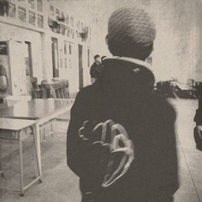

# 最難行的路 (The Hardest Path)


| Key | Value |
| --- | ----- |
| ID | 17 |
| Tags (Categories) | #reverse #misc #★★★☆☆ |
| Challenge release timestamp | 2021-11-12T13:00:00.000Z |
| Score | 300 |
| Total solves (Final) | 9 |

# YouTube

| Key | Value |
| --- | ----- |
| Avatar | 
| Singer (Challenge Author) | mystiz |
| Link | https://youtu.be/lOwNC-JqUOc |

# Description

> 寧願不揀最易的路 行極還未到
> 寧願你最後未傾慕 但信念安好
> 在意的 不再是 愛的煩惱
> 是哪樣做人 更清高
> 餘生那段旅途
> 與哪類人共舞

When you think reverse engineering is hard, try working on reverse engineering challenges those need your algorithmic thinking skills!

```bash
nc chalp.hkcert21.pwnable.hk 28117
```

### Attachments

- [the-hardest-path_e00c6aa7b64b8dc2a06e577937b5b07c.zip](./the-hardest-path_e00c6aa7b64b8dc2a06e577937b5b07c.zip)

# Solves
| ID | Name | Solve at |
| --- | ---- | -------- |
| 666 | T0003 - HKUST | 2021-11-12T18:33:49.526Z |
| 679 | O0004 - AUTOEXEC.BAT | 2021-11-12T19:10:57.507Z |
| 716 | The Duck | 2021-11-12T23:47:17.939Z |
| 717 | Super Guesser | 2021-11-12T23:51:52.259Z |
| 812 | O0027 - UND3r 20 D53 H473r5 4ND r374K3r | 2021-11-13T05:28:05.669Z |
| 1408 | O0056 - AVADA KEDAVRA | 2021-11-14T02:57:18.465Z |
| 1447 | O0084 - Never Gonna Let You Dump | 2021-11-14T04:47:14.227Z |
| 1587 | T0028 - CUHK,PolyU,HKCC | 2021-11-14T09:33:37.954Z |
| 1619 | O0061 - GoGoWeaponGo | 2021-11-14T09:58:02.242Z |