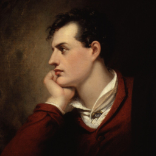

# 無聲浪 (The Wave of Us)


| Key | Value |
| --- | ----- |
| ID | 11 |
| Tags (Categories) | #forensics #☆☆☆☆☆ |
| Challenge release timestamp | 2021-11-12T10:00:00.000Z |
| Score | 50 |
| Total solves (Final) | 152 |

# YouTube

| Key | Value |
| --- | ----- |
| Avatar | 
| Singer (Challenge Author) | byronwai |
| Link | https://youtu.be/AGU_FMudl1Y |

# Description

> 像密碼 若無線索
> 只好留下困惑

_IEEE Transactions on Signal Processing, Vol.51, (no.4), pp.1020–33, 2003._

Walkthrough:

1. Google the description
2. Find the [GitHub repository](https://github.com/toots/microsoft-audio-watermarking) written by Microsoft 
3. Download the tool (repository) in zip
4. Extract the zip, for example, you extract the zip under `D:\Downloads`
5. Copy the audio file (`waterwave.wav`) to `D:\Download\microsoft-audio-watermarking-master\build\`
6. Open the command prompt and execute the following:
```
D:\Download\microsoft-audio-watermarking-master\build\detect2003.exe D:\Download\microsoft-audio-watermarking-master\build\watermark.wav
```
7. Record ass Hex decoded
7. Convert all Hex it into ASCII characters, there are many [online tools](https://www.binaryhexconverter.com/hex-to-ascii-text-converter) that can be used
8. Profit

有部分參賽者反應 Github 上的工具未能正常執行。請使用命令提示字元(cmd.exe)打開該程式。
There is some contester mentioned that the tool on Github cannot be executed normally. Please use command prompt (cmd.exe) to execute the program.

### Attachments

- [the-wave-of-us_ed82d2616c9d118d8dc8637022902330.zip](./the-wave-of-us_ed82d2616c9d118d8dc8637022902330.zip)

# Solves
| ID | Name | Solve at |
| --- | ---- | -------- |
| 97 | T0085 - PolyU | 2021-11-12T10:08:53.203Z |
| 118 | O0083 - c0rrupted flags | 2021-11-12T10:13:51.555Z |
| 120 | S0107 - CHANG PUI CHUNG MEMORIAL SCHOOL | 2021-11-12T10:14:30.611Z |
| 123 | O0084 - Never Gonna Let You Dump | 2021-11-12T10:14:50.360Z |
| 127 | T0006 - CityU,PolyU | 2021-11-12T10:15:34.279Z |
| 142 | S0048 - TWGHs Wong Fut Nam College | 2021-11-12T10:18:39.449Z |
| 149 | S0007 - HKCCCU Logos Academy | 2021-11-12T10:20:19.792Z |
| 152 | O0059 - Fragile❤ | 2021-11-12T10:20:53.654Z |
| 157 | S0005 - Shatin Tsung Tsin Secondary School | 2021-11-12T10:22:35.773Z |
| 160 | T0030 - HKUST,CityU | 2021-11-12T10:23:51.852Z |
| 166 | O0079 - NullPointer | 2021-11-12T10:25:03.497Z |
| 182 | T0091 - HKU | 2021-11-12T10:29:43.823Z |
| 193 | T0032 - HKCC,UOWCHK | 2021-11-12T10:32:42.187Z |
| 209 | T0057 - HKUST | 2021-11-12T10:40:34.623Z |
| 211 | T0095 - CUHK | 2021-11-12T10:41:02.793Z |
| 217 | T0065 - HKUST | 2021-11-12T10:43:53.809Z |
| 222 | S0112 - LOCK TAO SECONDARY SCHOOL | 2021-11-12T10:47:41.178Z |
| 226 | S0037 - King's College | 2021-11-12T10:49:15.932Z |
| 237 | O0062 - P2403 | 2021-11-12T10:52:55.889Z |
| 240 | T0003 - HKUST | 2021-11-12T10:55:41.552Z |
| 241 | O0030 - Will code for food | 2021-11-12T10:55:48.090Z |
| 250 | S0051 - Carmel Alison Lam Foundation Secondary School | 2021-11-12T11:00:25.118Z |
| 255 | O0086 - offsecFansclub | 2021-11-12T11:02:35.115Z |
| 257 | O0054 - Mama Sung | 2021-11-12T11:02:58.474Z |
| 259 | O0074 - CLS | 2021-11-12T11:03:56.601Z |
| 261 | T0042 - HKUST | 2021-11-12T11:04:57.148Z |
| 268 | O0027 - UND3r 20 D53 H473r5 4ND r374K3r | 2021-11-12T11:10:51.817Z |
| 270 | T0025 - IVE(TM) | 2021-11-12T11:11:33.317Z |
| 277 | T0039 - CUHK | 2021-11-12T11:14:59.824Z |
| 285 | T0075 - CUHK | 2021-11-12T11:19:09.492Z |
| 287 | T0040 - HKCC,HKUST | 2021-11-12T11:22:58.159Z |
| 292 | S0008 - The Chinese Foundation Secondary School | 2021-11-12T11:28:43.687Z |
| 294 | O0085 - Hacker T | 2021-11-12T11:30:25.102Z |
| 299 | O0061 - GoGoWeaponGo | 2021-11-12T11:32:25.439Z |
| 300 | O0077 - Kappa's Mouth | 2021-11-12T11:33:52.691Z |
| 303 | O0056 - AVADA KEDAVRA | 2021-11-12T11:36:13.588Z |
| 307 | O0043 - The Almighty Dragon | 2021-11-12T11:39:37.002Z |
| 320 | T0038 - HKUST | 2021-11-12T11:51:38.598Z |
| 333 | T0036 - CUHK | 2021-11-12T11:56:24.290Z |
| 334 | T0087 - CityU | 2021-11-12T11:57:03.239Z |
| 337 | S0027 - HKSYCIA Wong Tai Shan Memorial College | 2021-11-12T11:57:36.967Z |
| 338 | S0056 - Queen's College Old Boys' Association Secondary School | 2021-11-12T11:58:00.134Z |
| 346 | T0010 - CityU,PolyU | 2021-11-12T12:06:06.297Z |
| 349 | O0065 - HowDoYouTurnThisOn | 2021-11-12T12:10:10.097Z |
| 358 | T0033 - HKMU | 2021-11-12T12:21:42.822Z |
| 364 | O0004 - AUTOEXEC.BAT | 2021-11-12T12:27:46.118Z |
| 367 | T0028 - CUHK,PolyU,HKCC | 2021-11-12T12:30:38.245Z |
| 384 | MOCSCTF-A | 2021-11-12T12:44:10.104Z |
| 388 | O0020 - SKWD | 2021-11-12T12:47:45.306Z |
| 390 | T0062 - HKCC | 2021-11-12T12:48:10.276Z |
| 393 | T0071 - IVE (CW) | 2021-11-12T12:51:00.284Z |
| 395 | T0088 - HKMU | 2021-11-12T12:53:16.127Z |
| 399 | O0055 - Braindump | 2021-11-12T13:00:38.147Z |
| 406 | O0016 - ePotato | 2021-11-12T13:05:20.742Z |
| 407 | S0031 - Ying Wa College | 2021-11-12T13:05:50.078Z |
| 409 | S0041 - CARMEL SECONDARY SCHOOL | 2021-11-12T13:06:04.158Z |
| 412 | O0071 - Noobtrytryonly | 2021-11-12T13:07:42.681Z |
| 413 | S0073 - Ying Wa College | 2021-11-12T13:07:49.550Z |
| 416 | O0021 - KESR | 2021-11-12T13:09:50.898Z |
| 421 | T0068 - HKMU | 2021-11-12T13:12:16.718Z |
| 424 | O0066 - QWErTY | 2021-11-12T13:17:52.283Z |
| 438 | S0033 - CCC Ming Yin College | 2021-11-12T13:26:14.594Z |
| 453 | O0024 - SquidGamer | 2021-11-12T13:42:13.203Z |
| 459 | T0050 - HKCC | 2021-11-12T13:47:25.010Z |
| 460 | MOCSCTF-B | 2021-11-12T13:50:37.712Z |
| 464 | T0047 - HKUST | 2021-11-12T13:53:24.465Z |
| 466 | S0030 - St. Francis Xavier's College | 2021-11-12T13:53:46.341Z |
| 472 | O0010 - HackyClub | 2021-11-12T13:59:02.927Z |
| 476 | T0004 - HKUST,HKU SPACE,CUHK | 2021-11-12T14:05:52.316Z |
| 485 | S0013 - St. Francis Xavier's School, Tsuen Wan | 2021-11-12T14:17:50.374Z |
| 489 | S0019 - St. Francis Xavier's School, Tsuen Wan | 2021-11-12T14:24:51.862Z |
| 490 | O0039 - Buddiesss | 2021-11-12T14:25:13.511Z |
| 495 | O0050 - 7M5_N650C | 2021-11-12T14:32:11.432Z |
| 503 | O0012 - HWK | 2021-11-12T14:37:57.786Z |
| 507 | S0049 - TWGHs Wong Fut Nam College | 2021-11-12T14:43:14.499Z |
| 518 | S0003 - Kwun Tong Maryknoll College | 2021-11-12T14:54:58.217Z |
| 519 | O0067 - HC2021 | 2021-11-12T14:55:13.440Z |
| 522 | T0074 - PolyU | 2021-11-12T14:57:06.350Z |
| 534 | Super Guesser | 2021-11-12T15:11:15.852Z |
| 536 | S0092 - Immaculate Heart of Mary College | 2021-11-12T15:13:21.051Z |
| 543 | S0043 - CARMEL SECONDARY SCHOOL | 2021-11-12T15:20:00.698Z |
| 549 | S0018 - The Chinese Foundation Secondary School | 2021-11-12T15:26:23.578Z |
| 553 | O0072 - Royal Sunflower Tea | Tea to enrich your day | 2021-11-12T15:29:16.799Z |
| 560 | S0062 - CARMEL SECONDARY SCHOOL | 2021-11-12T15:35:04.078Z |
| 564 | O0069 - Chris love Pro Fong | 2021-11-12T15:41:20.840Z |
| 571 | O0068 - HC2021A | 2021-11-12T15:46:49.166Z |
| 577 | O0063 - Jukerland | 2021-11-12T15:55:02.501Z |
| 581 | T0076 - CUHK | 2021-11-12T15:58:08.475Z |
| 597 | T0049 - HKU SPACE | 2021-11-12T16:23:49.333Z |
| 615 | O0053 - Si Daan Kau Gei La | 2021-11-12T16:55:09.285Z |
| 675 | S0086 - Man Kwan QualiEd College | 2021-11-12T18:58:00.308Z |
| 680 | Beast_From_UIT | 2021-11-12T19:14:23.398Z |
| 690 | O0025 - SatayBeefNoodles | 2021-11-12T20:03:22.752Z |
| 693 | T0021 - CUHK | 2021-11-12T20:11:51.847Z |
| 700 | DarkArmy | 2021-11-12T20:49:15.962Z |
| 712 | T0037 - HKBU,CityU,HKMU | 2021-11-12T22:43:37.627Z |
| 715 | S0059 - Fanling Kau Yan College | 2021-11-12T23:46:46.357Z |
| 729 | S0039 - Fanling Rhenish Church Secondary School | 2021-11-13T01:02:42.618Z |
| 730 | S0038 - Fanling Rhenish Church Secondary School | 2021-11-13T01:03:36.094Z |
| 731 | S0040 - Fanling Rhenish Church Secondary School | 2021-11-13T01:03:38.267Z |
| 750 | O0034 - TeamMiracle | 2021-11-13T02:55:36.068Z |
| 753 | S0094 - King's College | 2021-11-13T03:07:27.071Z |
| 755 | T0090 - HKUST | 2021-11-13T03:10:16.594Z |
| 778 | S0101 - Youth College (Kwai Fong) | 2021-11-13T03:56:55.347Z |
| 781 | O0008 - RTP | 2021-11-13T04:07:30.287Z |
| 783 | S0035 - LOCK TAO SECONDARY SCHOOL | 2021-11-13T04:11:26.733Z |
| 788 | S0147 - De La Salle Secondary School, N.T. | 2021-11-13T04:22:59.578Z |
| 790 | S0093 - De La Salle Secondary School, N.T. | 2021-11-13T04:25:01.301Z |
| 792 | S0151 - De La Salle Secondary School, N.T. | 2021-11-13T04:30:13.703Z |
| 807 | T0007 - CUHK | 2021-11-13T05:15:26.862Z |
| 830 | T0072 - IVE (CW) | 2021-11-13T06:20:01.506Z |
| 837 | S0111 - Pui Ching Middle School | 2021-11-13T06:34:33.959Z |
| 850 | O0060 - Nobody | 2021-11-13T06:53:44.676Z |
| 895 | S0095 - Buddhist Sin Tak College | 2021-11-13T08:09:16.642Z |
| 944 | O0019 - Team 388 | 2021-11-13T09:26:03.611Z |
| 1038 | O0047 - FlowerTea | 2021-11-13T10:34:49.181Z |
| 1042 | O0046 - TeammatesNotFound | 2021-11-13T10:38:51.065Z |
| 1055 | O0073 - knownothing | 2021-11-13T10:50:38.313Z |
| 1072 | T0053 - THEi | 2021-11-13T11:06:27.016Z |
| 1078 | T0092 - HKCC | 2021-11-13T11:14:33.581Z |
| 1079 | T0061 - CUHK | 2021-11-13T11:15:42.593Z |
| 1083 | S0057 - SKH Tang Shiu King Secondary School | 2021-11-13T11:22:23.249Z |
| 1093 | S0052 - St. Francis Xavier's College | 2021-11-13T11:34:30.280Z |
| 1094 | T0059 - HKCC | 2021-11-13T11:34:48.136Z |
| 1098 | O0018 - TechRebornation | 2021-11-13T11:42:00.718Z |
| 1117 | S0091 - Immaculate Heart of Mary College | 2021-11-13T12:26:54.225Z |
| 1128 | The Duck | 2021-11-13T12:44:14.711Z |
| 1135 | T0043 - PolyU,CUHK,SPEED | 2021-11-13T12:50:56.297Z |
| 1138 | S0061 - Po Leung Kuk Choi Kai Yau School | 2021-11-13T12:53:53.073Z |
| 1165 | T0060 - HKU SPACE | 2021-11-13T13:31:47.804Z |
| 1170 | S0042 - CARMEL SECONDARY SCHOOL | 2021-11-13T13:45:13.242Z |
| 1171 | S0016 - Tsuen Wan Public Ho Chuen Yiu Memorial College | 2021-11-13T13:46:52.653Z |
| 1172 | O0033 - HDMI | 2021-11-13T13:47:19.860Z |
| 1222 | O0044 - O0007 – PAYCheck | 2021-11-13T14:56:46.556Z |
| 1234 | T0035 - CUHK | 2021-11-13T15:08:44.495Z |
| 1235 | T0073 - HKBU,CUHK | 2021-11-13T15:09:48.912Z |
| 1236 | S0014 - Christian Alliance Cheng Wing Gee College | 2021-11-13T15:10:40.754Z |
| 1246 | S0090 - Immaculate Heart of Mary College | 2021-11-13T15:25:36.862Z |
| 1264 | T0056 - THEi | 2021-11-13T15:54:41.305Z |
| 1289 | S0009 - Tsuen Wan Public Ho Chuen Yiu Memorial College | 2021-11-13T16:32:14.918Z |
| 1307 | O0002 - MSPeople | 2021-11-13T16:56:56.093Z |
| 1317 | S0087 - Man Kwan QualiEd College | 2021-11-13T17:23:21.548Z |
| 1329 | O0009 - faulT | 2021-11-13T17:39:55.522Z |
| 1332 | T0064 - HKUST | 2021-11-13T17:46:46.939Z |
| 1347 | T0045 - HKU,HKUST,CUHK | 2021-11-13T18:35:03.787Z |
| 1390 | S0004 - St. Paul's Secondary School | 2021-11-14T01:49:07.126Z |
| 1416 | S0010 - The Chinese Foundation Secondary School | 2021-11-14T03:41:01.174Z |
| 1428 | S0036 - Carmel Pak U Secondary School | 2021-11-14T04:05:20.836Z |
| 1465 | T0018 - HKU | 2021-11-14T05:27:19.982Z |
| 1467 | S0023 - Tsuen Wan Public Ho Chuen Yiu Memorial College | 2021-11-14T05:29:31.472Z |
| 1483 | S0047 - Munsang College (Hong Kong Island) | 2021-11-14T06:20:38.081Z |
| 1576 | O0058 - Try_harder | 2021-11-14T09:27:01.608Z |