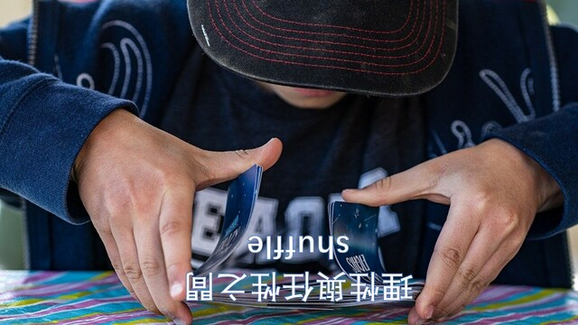

# 理性與任性之間 (Shuffle)

| Key | Value |
| --- | ----- |
| ID | 43 |
| Tags (Categories) | #reverse #☆☆☆☆☆ |
| Challenge release timestamp | 2021-11-12T10:00:00.000Z |
| Score | 50 |
| Total solves (Final) | 60 |

# YouTube

| Key | Value |
| --- | ----- |
| Avatar | 
| Singer (Challenge Author) | harrier |
| Link | https://youtu.be/xMLuHGu-BPU |

# Description

I heard perfect shuffle is reproducible...

Hint (Updated on 13 Nov 19:05):

- What is `.pyc`? Are there some tools for reverting pyc to some readable source (maybe back to python script)?
- Maybe you can use decompyle3 or uncompyle6 to convert to pyc back to python script?
- Next you have to revert the algorithm for flag, i.e. given the output, find the corresponding input (which is flag)
- Understanding random module should help a lot... What is `random.seed`?
- Why do this always produces same result (for same input) but not randomly differ each time? Can you make use of this to revert back to flag?
- If it generate the same "shuffling" everytime, you should be able to know how the flag shuffles, then revert the process to get the flag? 

Hint: (Update on 13 Nov 22:32)
`random.seed` will reset the randomness state when you call it, so look carefully what the original script does!

Hint: (Update on 14 Nov 4:10)
Check the python version outputted by decompyle3 / uncompyle6. Python 2 and 3 are VERY different!
Also try to decompose the code into different parts if you found it too hard to understand. Maybe give it some data to test?

### Attachments

- [shuffle_03f016d972f11c15bb25d038a2bd6bb3.zip](./shuffle_03f016d972f11c15bb25d038a2bd6bb3.zip)

# Solves
| ID | Name | Solve at |
| --- | ---- | -------- |
| 86 | T0003 - HKUST | 2021-11-12T10:07:22.143Z |
| 203 | T0064 - HKUST | 2021-11-12T10:37:05.853Z |
| 216 | T0047 - HKUST | 2021-11-12T10:43:27.998Z |
| 254 | T0010 - CityU,PolyU | 2021-11-12T11:02:28.954Z |
| 263 | O0004 - AUTOEXEC.BAT | 2021-11-12T11:06:41.308Z |
| 290 | O0027 - UND3r 20 D53 H473r5 4ND r374K3r | 2021-11-12T11:26:00.566Z |
| 297 | T0065 - HKUST | 2021-11-12T11:30:36.680Z |
| 305 | T0087 - CityU | 2021-11-12T11:38:43.755Z |
| 311 | T0057 - HKUST | 2021-11-12T11:42:39.269Z |
| 313 | T0028 - CUHK,PolyU,HKCC | 2021-11-12T11:43:07.753Z |
| 319 | O0067 - HC2021 | 2021-11-12T11:51:16.790Z |
| 342 | O0016 - ePotato | 2021-11-12T12:01:11.160Z |
| 362 | The Duck | 2021-11-12T12:27:11.830Z |
| 382 | T0042 - HKUST | 2021-11-12T12:40:37.354Z |
| 391 | O0056 - AVADA KEDAVRA | 2021-11-12T12:48:14.076Z |
| 402 | T0068 - HKMU | 2021-11-12T13:01:59.061Z |
| 423 | S0043 - CARMEL SECONDARY SCHOOL | 2021-11-12T13:17:29.617Z |
| 428 | T0095 - CUHK | 2021-11-12T13:19:42.193Z |
| 450 | S0056 - Queen's College Old Boys' Association Secondary School | 2021-11-12T13:38:36.589Z |
| 471 | O0043 - The Almighty Dragon | 2021-11-12T13:58:49.661Z |
| 492 | O0055 - Braindump | 2021-11-12T14:27:41.900Z |
| 512 | Beast_From_UIT | 2021-11-12T14:48:52.870Z |
| 539 | O0066 - QWErTY | 2021-11-12T15:17:41.180Z |
| 576 | T0059 - HKCC | 2021-11-12T15:50:30.196Z |
| 586 | Super Guesser | 2021-11-12T16:00:40.113Z |
| 607 | O0083 - c0rrupted flags | 2021-11-12T16:38:31.245Z |
| 625 | DarkArmy | 2021-11-12T16:59:52.448Z |
| 639 | T0030 - HKUST,CityU | 2021-11-12T17:24:01.016Z |
| 640 | O0061 - GoGoWeaponGo | 2021-11-12T17:27:39.329Z |
| 681 | O0024 - SquidGamer | 2021-11-12T19:15:17.682Z |
| 710 | T0037 - HKBU,CityU,HKMU | 2021-11-12T21:58:41.215Z |
| 757 | O0077 - Kappa's Mouth | 2021-11-13T03:10:52.989Z |
| 776 | S0033 - CCC Ming Yin College | 2021-11-13T03:49:12.110Z |
| 796 | O0010 - HackyClub | 2021-11-13T04:40:07.984Z |
| 814 | O0025 - SatayBeefNoodles | 2021-11-13T05:32:58.980Z |
| 824 | T0025 - IVE(TM) | 2021-11-13T06:00:41.716Z |
| 834 | T0090 - HKUST | 2021-11-13T06:30:28.480Z |
| 838 | MOCSCTF-A | 2021-11-13T06:35:20.077Z |
| 839 | S0051 - Carmel Alison Lam Foundation Secondary School | 2021-11-13T06:36:31.262Z |
| 871 | O0086 - offsecFansclub | 2021-11-13T07:28:11.643Z |
| 925 | S0057 - SKH Tang Shiu King Secondary School | 2021-11-13T08:59:40.463Z |
| 1064 | T0004 - HKUST,HKU SPACE,CUHK | 2021-11-13T10:57:45.288Z |
| 1095 | S0082 - SKH Kei Hau Secondary School | 2021-11-13T11:35:59.073Z |
| 1226 | T0040 - HKCC,HKUST | 2021-11-13T15:00:30.079Z |
| 1228 | T0032 - HKCC,UOWCHK | 2021-11-13T15:02:08.507Z |
| 1229 | T0074 - PolyU | 2021-11-13T15:02:34.269Z |
| 1251 | O0072 - Royal Sunflower Tea | Tea to enrich your day | 2021-11-13T15:32:39.053Z |
| 1276 | T0039 - CUHK | 2021-11-13T16:10:32.749Z |
| 1279 | T0007 - CUHK | 2021-11-13T16:18:09.882Z |
| 1314 | O0054 - Mama Sung | 2021-11-13T17:11:15.042Z |
| 1339 | S0042 - CARMEL SECONDARY SCHOOL | 2021-11-13T18:04:58.667Z |
| 1397 | S0048 - TWGHs Wong Fut Nam College | 2021-11-14T02:23:44.580Z |
| 1436 | S0038 - Fanling Rhenish Church Secondary School | 2021-11-14T04:22:55.443Z |
| 1451 | S0040 - Fanling Rhenish Church Secondary School | 2021-11-14T04:59:17.756Z |
| 1452 | S0039 - Fanling Rhenish Church Secondary School | 2021-11-14T05:00:34.925Z |
| 1458 | T0036 - CUHK | 2021-11-14T05:05:33.820Z |
| 1531 | O0084 - Never Gonna Let You Dump | 2021-11-14T08:27:03.840Z |
| 1542 | S0003 - Kwun Tong Maryknoll College | 2021-11-14T08:38:32.607Z |
| 1572 | O0047 - FlowerTea | 2021-11-14T09:21:52.316Z |
| 1573 | T0033 - HKMU | 2021-11-14T09:22:38.226Z |