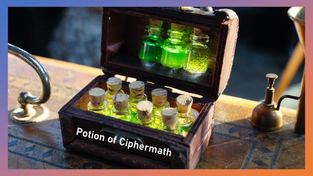

# 神奇的糊塗魔藥 (Potion of Ciphermath)



| Key | Value |
| --- | ----- |
| ID | 111 |
| Tags (Categories) | #crypto #misc #★★★★☆ |
| Challenge release timestamp | 2021-11-13T02:00:00.000Z |
| Score | 450 |
| Total solves (Final) | 1 |

# YouTube

| Key | Value |
| --- | ----- |
| Avatar | 
| Singer (Challenge Author) | mystiz |
| Link | https://youtu.be/jrP24ZSYHts |

# Description

> 無視道與理 是與非非 盼待往天飛 卻要撞地
> 在忙亂之中找到勇氣 一片塵埃中起飛

Let's speak in math! Of course we can make it harder by encrypting the numbers, too.

```bash
nc chalp.hkcert21.pwnable.hk 28201
```

> 這題被標上 Misc 的原因是它是道 PPC 問題 － 你需要想一個夠快的算法來解決問題。ICPC-ers / OI-ers 心動不如行動吧！
> This is labeled as a misc challenge because that is partly a PPC challenge - that you need to think of an efficient algorithm. ICPC-ers / OI-ers, go ahead!

### Attachments

- [magical-random-potion_d027eaf3f3ee51e40b6253c92476569f.zip](./magical-random-potion_d027eaf3f3ee51e40b6253c92476569f.zip)

# Solves
| ID | Name | Solve at |
| --- | ---- | -------- |
| 1300 | T0003 - HKUST | 2021-11-13T16:50:07.940Z |