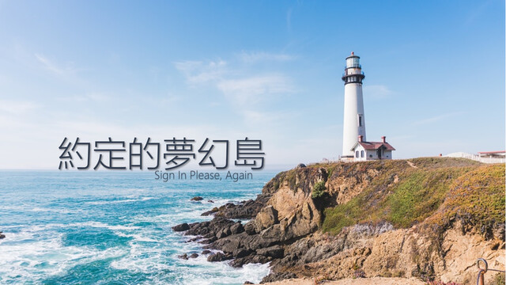

# 約定的夢幻島 (Sign In Please, Again)



| Key | Value |
| --- | ----- |
| ID | 67 |
| Tags (Categories) | #crypto #★★★★★ |
| Challenge release timestamp | 2021-11-12T13:00:00.000Z |
| Score | 500 |
| Total solves (Final) | 2 |

# YouTube

| Key | Value |
| --- | ----- |
| Avatar | 
| Singer (Challenge Author) | mystiz |
| Link | https://youtu.be/BFdj161FnBs |

# Description

> 不枉我們奮鬥過 和壞人拼搏過
> 燃亮如熊熊烈火
> 當初有誰諷刺過 胡亂抨擊過 亦也走得過
> 或誰也會照笑 笑我傻 說這裏也有折磨
> 卻有你有我 曾無懼逐關過
> 重新開始我們上多課

Okay. My secure authentication system was proved insecure (see [here](https://github.com/samueltangz/ctf-archive-created/tree/master/20201006-hkcert-ctf/sign-in-please)) as it got exploited last year by a bunch of bad guys. I improved the system and you would not be able to eavesdrop the passwords ever again.

```bash
nc chalp.hkcert21.pwnable.hk 28167
```

### Attachments

- [the-promised-neverland_b500babf2da78c9c68ee06d79aace461.zip](./the-promised-neverland_b500babf2da78c9c68ee06d79aace461.zip)

# Solves
| ID | Name | Solve at |
| --- | ---- | -------- |
| 683 | T0003 - HKUST | 2021-11-12T19:18:57.453Z |
| 1370 | The Duck | 2021-11-13T21:13:25.688Z |