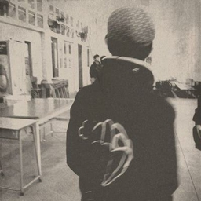

# 荊棘海 (The Wilderness)

| Key | Value |
| --- | ----- |
| ID | 64 |
| Tags (Categories) | #web #★☆☆☆☆ |
| Challenge release timestamp | 2021-11-13T06:00:00.000Z |
| Score | 100 |
| Total solves (Final) | 39 |

# YouTube

| Key | Value |
| --- | ----- |
| Avatar | 
| Singer (Challenge Author) | mystiz |
| Link | https://youtu.be/lbuUY4s8rYs |

# Description

> 就在回望一刻總有哀
> 世界已不再
> 誰偏偏一再
> 等待 到終於不記得等待

Mystiz likes PHP most. He has been programming in PHP at the time PHP 5 was released. Time flies and here comes PHP 8. He decided to craft a Docker image as a sandbox... What can go wrong?

http://chalp.hkcert21.pwnable.hk:28364/

### Attachments

- [sea-of-thorns_e045a87b1909724e7292510354cc1f3b.zip](./sea-of-thorns_e045a87b1909724e7292510354cc1f3b.zip)

# Solves
| ID | Name | Solve at |
| --- | ---- | -------- |
| 825 | O0027 - UND3r 20 D53 H473r5 4ND r374K3r | 2021-11-13T06:07:02.702Z |
| 827 | O0083 - c0rrupted flags | 2021-11-13T06:08:15.803Z |
| 829 | O0072 - Royal Sunflower Tea | Tea to enrich your day | 2021-11-13T06:19:25.457Z |
| 843 | T0039 - CUHK | 2021-11-13T06:42:17.105Z |
| 844 | T0003 - HKUST | 2021-11-13T06:42:38.682Z |
| 848 | The Duck | 2021-11-13T06:50:32.654Z |
| 849 | T0028 - CUHK,PolyU,HKCC | 2021-11-13T06:50:36.720Z |
| 851 | T0085 - PolyU | 2021-11-13T06:53:59.700Z |
| 858 | O0004 - AUTOEXEC.BAT | 2021-11-13T07:03:21.774Z |
| 861 | T0086 - PolyU | 2021-11-13T07:06:15.460Z |
| 875 | O0047 - FlowerTea | 2021-11-13T07:41:02.812Z |
| 884 | S0048 - TWGHs Wong Fut Nam College | 2021-11-13T07:47:39.886Z |
| 885 | T0010 - CityU,PolyU | 2021-11-13T07:51:45.468Z |
| 886 | T0033 - HKMU | 2021-11-13T07:51:51.966Z |
| 892 | O0056 - AVADA KEDAVRA | 2021-11-13T08:00:01.147Z |
| 902 | O0016 - ePotato | 2021-11-13T08:21:35.844Z |
| 904 | O0086 - offsecFansclub | 2021-11-13T08:26:56.800Z |
| 919 | Super Guesser | 2021-11-13T08:52:05.251Z |
| 921 | T0025 - IVE(TM) | 2021-11-13T08:53:39.926Z |
| 1023 | T0037 - HKBU,CityU,HKMU | 2021-11-13T10:25:16.489Z |
| 1033 | O0010 - HackyClub | 2021-11-13T10:31:16.682Z |
| 1039 | O0061 - GoGoWeaponGo | 2021-11-13T10:34:54.570Z |
| 1088 | T0042 - HKUST | 2021-11-13T11:27:52.840Z |
| 1091 | T0047 - HKUST | 2021-11-13T11:32:24.502Z |
| 1102 | T0032 - HKCC,UOWCHK | 2021-11-13T11:44:46.679Z |
| 1119 | O0055 - Braindump | 2021-11-13T12:29:36.468Z |
| 1164 | MOCSCTF-A | 2021-11-13T13:31:16.049Z |
| 1176 | DarkArmy | 2021-11-13T13:51:10.682Z |
| 1191 | T0074 - PolyU | 2021-11-13T14:09:04.309Z |
| 1205 | S0009 - Tsuen Wan Public Ho Chuen Yiu Memorial College | 2021-11-13T14:28:15.007Z |
| 1260 | O0053 - Si Daan Kau Gei La | 2021-11-13T15:48:04.620Z |
| 1261 | T0091 - HKU | 2021-11-13T15:49:20.289Z |
| 1282 | O0059 - Fragile❤ | 2021-11-13T16:21:33.143Z |
| 1292 | O0030 - Will code for food | 2021-11-13T16:43:47.624Z |
| 1336 | T0087 - CityU | 2021-11-13T17:51:14.665Z |
| 1415 | O0024 - SquidGamer | 2021-11-14T03:35:52.076Z |
| 1509 | T0057 - HKUST | 2021-11-14T07:13:22.631Z |
| 1561 | O0075 - wtfIsCTF | 2021-11-14T09:07:00.048Z |
| 1598 | S0008 - The Chinese Foundation Secondary School | 2021-11-14T09:38:28.935Z |