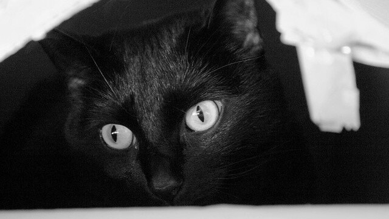

# 薛丁格的盒子 (Unobserved Box)



| Key | Value |
| --- | ----- |
| ID | 32 |
| Tags (Categories) | #pwn #reverse #★★☆☆☆ |
| Challenge release timestamp | 2021-11-12T13:00:00.000Z |
| Score | 250 |
| Total solves (Final) | 6 |

# YouTube

| Key | Value |
| --- | ----- |
| Avatar | 
| Singer (Challenge Author) | cire_meat_pop |
| Link | https://youtu.be/j5PLde-B9so |

# Description

All codes are uncertain before the measurement, and you will never make it.

Observe the code to get the flag.

```bash
nc chalp.hkcert21.pwnable.hk 28132
```

# Solves
| ID | Name | Solve at |
| --- | ---- | -------- |
| 600 | DarkArmy | 2021-11-12T16:28:28.075Z |
| 609 | The Duck | 2021-11-12T16:40:35.417Z |
| 613 | T0003 - HKUST | 2021-11-12T16:47:18.597Z |
| 705 | Super Guesser | 2021-11-12T21:22:27.841Z |
| 1538 | T0028 - CUHK,PolyU,HKCC | 2021-11-14T08:34:08.164Z |
| 1583 | O0027 - UND3r 20 D53 H473r5 4ND r374K3r | 2021-11-14T09:32:58.216Z |