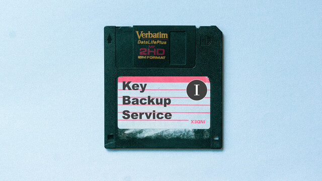

# 長話短說 (Key Backup Service 1)



| Key | Value |
| --- | ----- |
| ID | 57 |
| Tags (Categories) | #crypto #★☆☆☆☆ |
| Challenge release timestamp | 2021-11-12T13:00:00.000Z |
| Score | 150 |
| Total solves (Final) | 6 |

# YouTube

| Key | Value |
| --- | ----- |
| Avatar | 
| Singer (Challenge Author) | mystiz |
| Link | https://youtu.be/X8xnfwHPlK0 |

# Description

> 長話𥚃短說
> 但察覺太短
> 或者真正意義
> 並不需要說穿

_Note: This is part one of a two-part series. Part two: **Braceless / Key Backup Service 2**._

Mystiz made a key vault which could encrypts his darkest secrets (i.e., the flag). Everything is protected with a bank-level encryption (i.e., a 256-bit key). You are welcome to look at the encrypted secrets and praise his cryptographic knowledge.

```bash
nc chalp.hkcert21.pwnable.hk 28157
```

### Attachments

- [long-story-short_55e7b1b931d8aaa5670e38b1e14c82ea.zip](./long-story-short_55e7b1b931d8aaa5670e38b1e14c82ea.zip)

# Solves
| ID | Name | Solve at |
| --- | ---- | -------- |
| 477 | T0003 - HKUST | 2021-11-12T14:06:04.816Z |
| 531 | The Duck | 2021-11-12T15:07:41.766Z |
| 624 | Beast_From_UIT | 2021-11-12T16:59:48.271Z |
| 1081 | T0047 - HKUST | 2021-11-13T11:19:17.068Z |
| 1133 | Super Guesser | 2021-11-13T12:50:29.589Z |
| 1597 | O0027 - UND3r 20 D53 H473r5 4ND r374K3r | 2021-11-14T09:36:30.108Z |